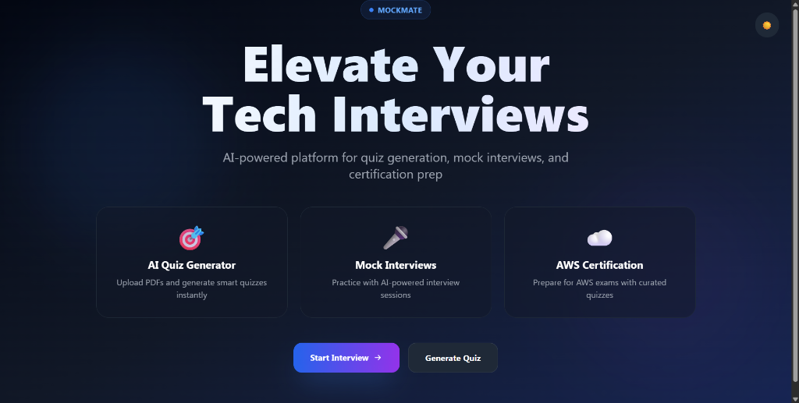

<div align="center">

[](https://mockmate-delta.vercel.app/)

### Mockmate - AI-Powered Interview Platform

<p align="center">
  
  
  
  
  
</p>

[**Live Demo 1**](https://mockmate-delta.vercel.app/) • [**Live Demo 2**](https://mockmate-fcn3errhj-2300030811s-projects.vercel.app/) • [**Report Bug**](https://github.com/2300030811/mockmate/issues)

</div>

<br />

## 🚀 Introduction

**Mockmate** is a cutting-edge platform designed to revolutionize technical interview preparation. By leveraging the power of **Google Gemini** and **Groq**, it transforms static study materials into interactive quizzes and conducts real-time voice-based mock interviews.

Whether you are preparing for an AWS certification or a software engineering role, Mockmate provides instant, intelligent feedback to help you elevate your skills.

## ✨ Key Features

### 🤖 AI Quiz Generator

- **Upload & Generate**: Simply upload a PDF or paste text.
- **Intelligent Processing**: Extracts key concepts to create relevant multiple-choice questions.
- **Smart Fallback**: Automatically switches between Gemini and Groq models to ensure high availability and bypass rate limits.
- **Instant Feedback**: Detailed explanations for every answer.

### 🎙️ Mock Interview Simulator

- **Voice Interaction**: Speak your answers and get real-time transcriptions (powered by Groq Whisper).
- **AI Interviewer**: Simulates a real hiring manager, providing constructive criticism on your answers.
- **Behavioral & Technical**: Supports various interview modes.

### ☁️ AWS Certification Prep

- Curated question banks for AWS Cloud Practitioner and Solutions Architect exams.
- Progress tracking to monitor your readiness.

## 🛠️ Tech Stack

- **Framework**: [Next.js 13](https://nextjs.org/) (App Router)
- **Language**: [TypeScript](https://www.typescriptlang.org/)
- **Styling**: [Tailwind CSS](https://tailwindcss.com/) + [Framer Motion](https://www.framer.com/motion/)
- **AI Models**:
  - Google Gemini (Flash 1.5 & 2.0)
  - Groq (Llama 3 & Distil-Whisper)
- **Deployment**: [Vercel](https://vercel.com/)

## 🌐 Live Deployments

Check out the live application running on Vercel:

| Environment    | URL                                                                                                                        |
| :------------- | :------------------------------------------------------------------------------------------------------------------------- |
| **Production** | [https://mockmate-delta.vercel.app/](https://mockmate-delta.vercel.app/)                                                   |
| **Preview**    | [https://mockmate-fcn3errhj-2300030811s-projects.vercel.app/](https://mockmate-fcn3errhj-2300030811s-projects.vercel.app/) |

## 📦 Installation & Setup

1.  **Clone the repository**

    ```bash
    git clone https://github.com/2300030811/mockmate.git
    cd mockmate
    ```

2.  **Install dependencies**

    ```bash
    npm install
    ```

3.  **Configure Environment Variables**
    Create a `.env.local` file:

    ```env
    # AI Keys (Required for Quiz & Interview)
    GROQ_API_KEY=gsk_...
    GOOGLE_API_KEY=...

    # App Config
    NEXT_PUBLIC_BASE_URL=http://localhost:3000
    ```

4.  **Run Locally**
    ```bash
    npm run dev
    ```

## 🤝 Contributing

Contributions are welcome! If you'd like to improve the AI prompts, add new features, or fix bugs, please fork the repository and submit a pull request.

---

<div align="center">
  <sub>Built with ❤️ by Bhima</sub>
</div>
